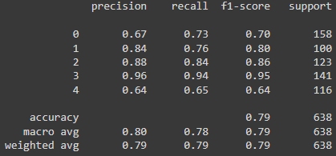
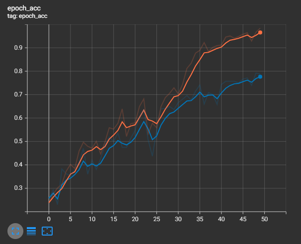
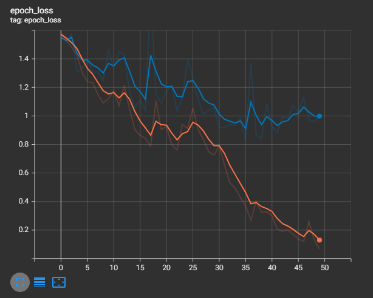
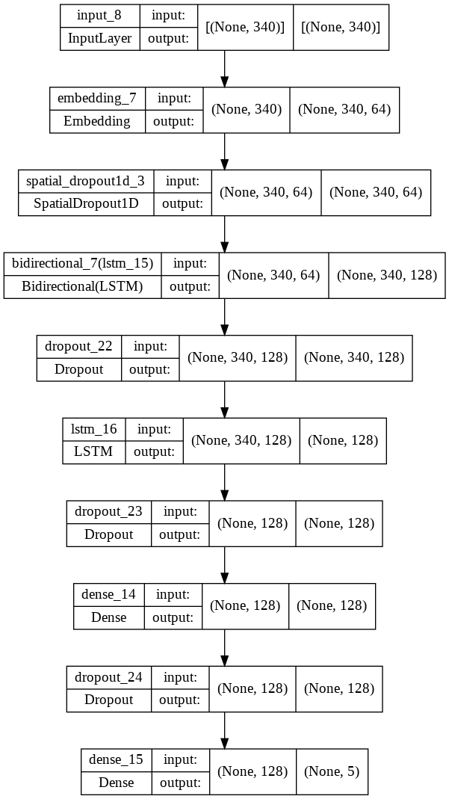

# Sentiment Analysis

The model is created to predict the type of category of a sentiment base on the words used in the sentence.

## Results

The model manages to score an accuracy of 79%. Although it is overfitting, but the model can still be used.

The graph of epochs was obtained using TensorBoard

## Model Architecture

The model used to train this data consists of embedding, bidirectional, spatialdropout1D, LSTM and dense layers.
Each hidden layers contains 128 nodes, after each layer it goes through dropout value of 20%.

## Credits

The data can be obtained from [GitHub](https://raw.githubusercontent.com/susanli2016/PyCon-Canada-2019-NLP-Tutorial/master/bbc-text.csv)
